# Chap.6 Color Image Processing

__Fullcolor__: acquired with a fullcolor sensor  
__Pseudocolor__: assigned colors to a particular monochrome intensity or range of intensities. 

$\quad\quad$Some of the gray-scale methods are directly applicable to color images.

## 6.1 Color Fundamentals

Intensity for achromatic light  
gray level for black-to-grays-to-white.

_Radiance_ from the source, _luminance_ by the observer, subjective _brightness_

$\quad\quad$It is important to keep in mind that having three specific primary color wavelengths for the purpose of standardization does not mean that these three fixed RGB components acting alone can generate all spectrum colors.

Primary colors of light: RGB  
Primary colors of pigments/colorants: magenta, cyan, yellow

$\quad\quad$CRT: array of triangular dot patterns of electron-sensitive phosphor that produce different colors.  In the case of LCD, light filters are used to produce the three primary colors of light.

$\quad\quad$Color characteristics: _brightness_, _hue_ (an attribute associated with the dominant wavelength in a mixture of light waves, like yellow, red, orange), _saturation_ (the relative purity or the amount of white light mixed with a hue).

_Chromaticity_: _Hue_, _saturation_  
[_Tristimulus_](https://en.wikipedia.org/wiki/CIE_1931_color_space#Tristimulus_values)
[CIE chromaticity diagram](https://en.wikipedia.org/wiki/CIE_1931_color_space#CIE_xy_chromaticity_diagram_and_the_CIE_xyY_color_space) 
_color gamut_: a range of colors produced by RGB monitors

## 6.2 Color Models

$\quad\quad$A _color model (color space, color system)_ is a specification of a coordinate system and a subspace within that system where each color is represented by a single point.

###### The RGB Color Model

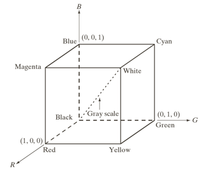

_pixel depth_: the number of bits used to represent each pixel in RGB space.

216 colors out of the 256 colors are de facto standard for _safe colors_. The safe-color cube has only valid colors on the surface cube.

###### The CMY and CMYK Color Models

$\quad\quad$Most devices that deposit colored pigments on paper such as color printers and copiers, require CMY data input or perform an RGB to CMY conversion.
$$
\pmatrix{C\\M\\ Y}=\pmatrix{1\\1\\1}-\pmatrix{R\\G\\B}
$$
A fourth color, black, combined with C M Y is added.

###### The HSI Color Model

Practical for human interpretation.

_Hue_: the angle by which a point rotates around the black-white axis, from red, through yellow, green, cyan, blue, magenta and back to red.  Undefined for a saturation of zero (white, black, and pure grays).
_Brightness_ (Intensity): the axis  
_Saturation_: distance from the axis

## 6.3 Pseudocolor Image Processing

$\quad\quad$For human visualization and interpretation. Humans can discern thousands of color shades and intensities, compared to only two dozen or so shades of gray.

###### Intensity Slicing

Gray scale $[0,L-1]$, $P$ planes perpendicular to the intensity axis and $0<P<L-1$, partitioning the gray scale into $P+1$ intervals, $V_1, V_2,...,V_{P+1}$. 
$$
f(x,y)=c_k \quad \text{if}\ f(x,y)\in V_k
$$

###### Intensity to Color Transformations

E.g. $f_R(x,y)$, $f_G(x,y)$ , $f_B(x,y)$ are sinusoids of different phases.

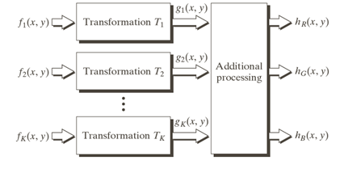

Sometimes it is of interest to combine several monochrome images into a single color composite.

## 6.4 Basics of Full-Color Image Processing

$\quad\quad$The results of individual color component processing are not always equivalent to direct processing in color vector space.

## 6.5 Color Transformations

$$
g(x,y)=T[f(x,y)]
$$

where the pixel values here are _triplets_ or _quartets_.
$$
s_i=T_i(r_1,r_2,...,r_n)
$$
where  $r_i$ and $s_i$ are variables denoting the color compoents of $f(x,y)$ and $g(x,y)$ at any point $(x,y)$, $n$ is the nubmer of color components and $\{T_1, T_2,..., T_n\}$ is a set of _transformation_ or _color mapping functions_  that operate on $r_i$ to produce $s_i$.

###### Color Complements

$\quad\quad$The hues directly opposite one another on the _color circle_ are called _complements_.

Color complements are useful for enhancing detail that is embedded in dark regions of a color image, particularly when the regions are dominant in size.

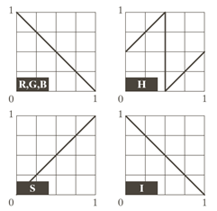

The RGB complement transformation here do not have a straightforward HSI space equivalent.

###### Color Slicing

$\quad\quad$Highlighting a specific range of colors in an image.

Approaches:   

1. display the colors of interest so that they stand out from the background 
2. use the region defined by the colors as a mask for further processing

$\quad\quad$One of the simplest way to slice a color image is to map the colors outside some range of interest to a nonprominent neutral color.
$$
s_i=\begin{cases}0.5 &\text{if } Dist(r,a)>D_0\\
r_i&\text{otherwise}\end{cases}
$$
where $Dist(r,a)$ is a distance measure and $a$ is a prototypical color.

###### Tone and Color Corrections

[Tints, Shades and Tones](https://en.wikipedia.org/wiki/Tints_and_shades)  
[Hue, Tint, Tone and Shade](https://color-wheel-artist.com/hue/)
[Color Balance](https://en.wikipedia.org/wiki/Color_balance)  

Most common use in photo enhancement and color reproduction.

__CIELAB__

$\quad\quad$ The _L\*a\*b color space_ is colorimetric (colors perceived as matching are encoded identically, perceptually uniform (color differences among various hues are perceived uniformly) and device indipendent.

_Tonal range, key-type, high-key, low-key, middle-key_

__Tonal transformations__: The idea is to adjust the image's brightness and contrast to provide maximum detail over a suitable range of intensities. In the RGB and CMYK spaces this means mapping all three or four color components with the same transformation function; in the HSI color space, only the _intensity_ component is modified.

__Color balancing__: determined objectively by analyzing with a color spectrometer a known color in an image, accurate visual assessments are possible when white areas where the RGB components are present. Skin tones also are excellent subjects for visual color assessments.

###### Histogram Processing

$\quad\quad$The gray-level histogram processing transformations can be applied to color images in an automated way. It is reasonably successful at handling low-, high-, and middle-key images. It is generally unwise to histogram equalize the components of a color image independently, which results in erroneous color. ==The HSI color space is ideally suited to this type of approach, which can be performed by equalizing only the intensity component==.

$\quad\quad$The intensity equalization process do not alter the values of hue and saturation of the image, it does impact the overall color perception.

## 6.6 Smoothing and Sharpening

#### Color Image Smoothing

$$
\bar{\vec{c}}(x,y)=\dfrac{1}{K}\sum\limits_{(s,t)\in S_{xy}}\vec{c}(s,t)
$$

Smoothing by neighborhood averaging can be carried out on a per-color-plane basis. One can only smooth the intensity component in HSI space.

#### Color Image Sharpening

$$
\triangledown^2[c(x,y)]=\pmatrix{\triangledown^2R(x,y)\\\triangledown^2G(x,y)\\\triangledown^2R(x,y)}
$$

That is, to compute the Laplacian of each component image separately. Still, one can sharpen only the intensity component in HSI space.

## 6.7 Image Segmentation Based on Color

#### Segmentation in HSI Color Space

It is natural to think first of the HSI space because color is conveniently represneted in the hue image. Typically, saturation is used as a masking image in order to isolate further regions of interest in the hue image.

#### Segmentation in RGB Vector Space

Segmentation is one area in which better results generally are obtained by using RGB color vectors. Given a set of sample color points representative of the colors of interest, we obtain an estimate of the "average" color points that we wish to segment. By introducing a distance measure $D(z,a)$, we can segment all points in RGB space less than a certain threshold.

#### Color Edge Detection

Processing three individual planes to form a composite gradient image can yield erroneous results. It may yields accpetable results for decting edges, but accuracy is an issue.

Let $r$, $g$ and $b$ be orthonormal vectors of RGB color space
$$
u=\dfrac{\partial R}{\partial x}r+\dfrac{\partial G}{\partial x}g+\dfrac{\partial B}{\partial x}b\\
v=\dfrac{\partial R}{\partial y}r+\dfrac{\partial G}{\partial y}g+\dfrac{\partial B}{\partial y}b\\
g_{xx}=u^Tu\\g_{yy}=v^Tv\\g_{xy}=u^Tv
$$
The direction and value of maximum rate of change of $c(x,y)$ is given by
$$
\theta(x,y)=\dfrac{1}{2}\tan^{-1}\bigg[\dfrac{2g_{xy}}{g_{xx}-g_{yy}}\bigg]\\
F_\theta(x,y)= \bigg\{\dfrac{1}{2}\big[(g_{xx}+g_{yy})+(g_{xx}-g_{yy})cos\ 2\theta(x,y) +2g_{xy}sin\ 2\theta(x,y)\big]\bigg\}^{\frac{1}{2}}
$$
Note that there are two $\theta$s that the one gives a maximum for $F_\theta(x,y)$, the other minimum. The partial derivatives required for implementing can be computed using the operators in gray-scale sharpening.

## 6.8 Noise in Color Images

$\quad\quad$It is possible for color channers to be affected differently by noise. Filtering of full-color images can be carried out on a per-image basis or directly in color vector space. Filters like the class of order statistics filters can not be used this way because of the essence of vectors of each pixel in a color image.

# Chap.7 Wavelets and Multiresolution Processing

$\quad\quad$Wavelet transforms are based on small waves, called _wavelets_, of varying frequency _and limited duration_, which provide the equivalent of a musical score for an image, not only what frequencies but also when. 

## 7.1 Background

$\quad\quad$If both small and large objects or low- and high-contrast objects are present simultaneously, it can be advantageous to study them at several resolutions.

#### Image Pyramids

$\quad\quad$A powerful yet conceptually simple structure for representing images at more than one resolutution is the _image pyramid_. An image pyramid is a collection of decresing resolution images arranged in the shape of a pyramid.

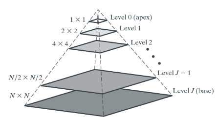

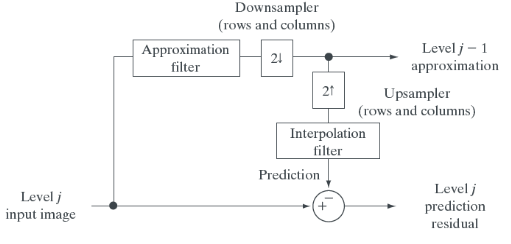

Approximations form an approximation pyramid and predicition residuals form a prediction residual pyramid, which are computed iteratively. 

Approximation filter candidates: neighborhood averaging (mean pyramids), lowpass Gaussian filtering (Gaussian pyramids), no filtering (subsampling pyramids).

Interpolation: nearest-neighborhood, bilinear, bicubic.

$\quad\quad$In the absence of quantization error, the resulting prediction residual pyramid can be used to generate the complementray approximation including the original image without error. Prediction residual images can be highly compressed by assigning fewer bits to the more probable values.

#### Subband Coding

$\quad\quad$In subband coding, an image is decomposed into a set of bandlimited components called subbands. The decomposition is performed so that the subbands can be reasembled to reconstruct the original image without error.

A digital filter:
$$
\hat{f}(n)=\sum\limits^{\infin}_{k=-\infin}h(k)f(n-k)
$$
where $h(k)$'s are called _filter coefficients_, defining _filter taps_, whose number is the _order_ of the filter. Given a finite number of $h(k)$'s, a _finite impulse response_ (a.k.a FIR) is formed. 

Given a filter $h_1(n)$: 

1. $h_2(n)=-h_1(n)$: sign reversal 
2. $h_3(n)=h_1(-n)$: order and time reversal
3. $h_4(n)=h_1(K-1-n)$: order reversal
4. $h_5(n)=(-1)^nh_1(n)$ and $h_6(n)=(-1)^nh_1(K-1-n)$: modulation

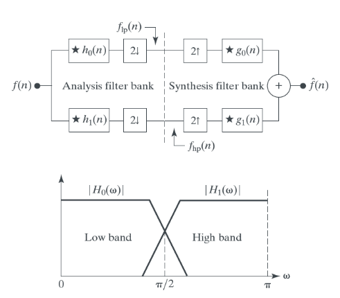

The analysis filter bank breaks input sequence into two half-length sequences, the _subbands_. Synthesis bank filters combine them and produce the _approximation_, identical to the original input. The system is siad to employ _perfect reconstruction fitlers_.

$\quad\quad$The synthesis filters are modulated versions of the analysis filter. For perfect reconstruction, there are the following conditions:

_Cross-modulation_:
$$
g_0(n)=(-1)^nh_1(n)\\
g_1(n)=(-1)^{n+1}h_0(n)
$$
or 
$$
g_0(n)=(-1)^{n+1}h_1(n)\\
g_1(n)=(-1)^{n}h_0(n)
$$
_Biorthogonality condition_: 
$$
\langle h_i(2n-k),g_j(k)\rangle=\delta(i-j)\delta(n),\quad i,j=\{0,1\}
$$
Some may satisfy _orthonormality_: 
$$
\langle g_i(n),g_j(n+2m)\rangle=\delta(i-j)\delta(m),\quad i,j=\{0,1\}
$$
Moreover, they satisfy:
$$
g_1(n)=(-1)^ng_0(K_{even}-1-n)\\
h_i(n)=g_i(K_{even}-1-n),\quad i=\{0,1\}
$$
where $K_{even}$ is an even number.

$\quad\quad$An orthonormal filter bank can be developped around the impulse response of a single filter called the _prototype_. For biorthogonal filter banks, two prototypes are required. 1-D orthonormal and biorthogonal filters can be used as 2-D separablefilters for the processing of images, resulting in four subbands: _approxiamtion, vertical detail, horizontal detail_ and _diagonal detail._

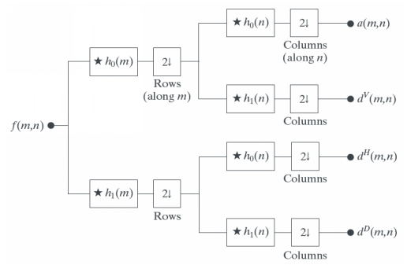

#### The Haar Transform

$$
T=HFH^T
$$

where $F, H,T$ are $N\times N$ matrices. The ith row of $H$ contains the elements of the _Haar basis functions_ $h_i(z)$ for $z=0/N,1/N,2/N,\dots,(N-1)/N$.

__Haar basis functions__: 

Define the integer $k$ s.t. $k=2^p+q-1$, where $0\leq p\leq n-1$, $q=0$ or $1$ for $p=0$ and $1\leq q \leq 2^p$ for $p\neq 0$.
$$
h_0(z)=h_{00}(z)=\dfrac{1}{\sqrt{N}},\quad z\in [0,1]
$$
and 
$$
h_k(z)=h_{pq}(z)=\dfrac{1}{\sqrt{N}}\begin{cases}2^{p/2} & (q-1)/2^p\leq z<(q-0.5)/2^p\\
-2^{p/2} & (q-0.5)/2^p\leq z<q/2^p\\
0&\quad otherwise, z\in [0,1]\end{cases}
$$
That is, given a $k$, decompose it into $p$ and $q$, then a basis function is determined. 

$$
\mathrm{H}_2=\dfrac{1}{\sqrt{2}}\begin{bmatrix}1&1\\1&-1\end{bmatrix}
$$
$\quad\quad$Our principal interest in the Haar transform is that the rows of $H_2$ can be used to define the analysis filters of a 2-tap perfect reconstruction filter bank, as well as the scaling and wavelet vectors.

## 7.2 Multiresolution Expansions

#### Series Expansions

$$
f(x)=\sum\limits_{k}a_k\phi_k(x)
$$

where $a_k$: expansion coefficents, $\phi_k(x)$ : expansion functions. if unique (linearly independent), then called _basis functions_, and the _expansion set_ is called a _basis_, forming a _function space_ referred to as the _closed span_ of the expansion set.

The coefficients $a_k$ can be obtained by doing _integeral inner products_ ([Inner product in Hilbert space](https://en.wikipedia.org/wiki/Inner_product_space#Hilbert_space))of the _dual functions_ of the expansion funtions, i.e.
$$
a_k=\langle \tilde{\phi}_k(x),f(x)\rangle=\int \tilde{\phi}_k^*(x)f(x)\ dx
$$
__Orthonormality__:
$$
\langle\phi_j(x),\phi_k(x)\rangle=\delta_{jk}=\begin{cases}0&j\neq k\\1&j=k\end{cases}
$$
__Biorthogonality__: The expansion functions are not orthonormal but an orthogonal basis for $V$, the basis functions and their duals are caleed _biorthogonal._  

[Biorthogonal system in Wikipedia](https://en.wikipedia.org/wiki/Biorthogonal_system)
$$
\langle\phi_j(x),\tilde{\phi}_k(x)\rangle=\delta_{jk}=\begin{cases}0&j\neq k\\1&j=k\end{cases}
$$
If the expansion set is not a basis, then they and their duals are _overcomplete_ or _redundant_, forming a _frame_ in which
$$
A\|f(x)\|^2\leq\sum\limits_k|\langle\phi_k(x),f(x)\rangle|^2\leq B\|f(x)\|^2
$$
for some $A>0, B<\infin$ and all $f(x)\in V$

If $A=B$, the expansion set is called a _tight frame_, and $f(x)=\dfrac{1}{A}\sum\limits_k\langle\phi_k(x),f(x)\rangle\phi_k(x)$ .

#### Scaling Functions

$L^2(R)$: the set of _measurable_, _square-integrable_ one-dimension functions.  
$\phi(x)$: a real, square-integrable function  
$j, k\in \mathit{Z}$ 
$$
\phi_{j,k}(x)=2^{j/2}\phi(2^jx-k)
$$
By choosing $\phi(x)$ properly, $\big\{\phi_{j,k}(x)\big\}$ can be made to span $L^2(R)$.  Taking $k$ as a parameter, 
$$
V_j=\overline{\underset{k}{Span}\big\{\phi_{j,k}(x)\big\}}
$$
as $j$ increases, the $\phi_{j,k}(x)$ becomes narrower and separated by smaller changes in $x$, and thus increases the size of $V_j$, allowing functions with smaller variations or finer detail to be included.

__MRA (MultiResolution Analysis):__   

1. The scaling function is orthogonal to its integer translates (Orthogonality) 
2. The subspaces spanned by the scaling function at low scales are nested within those spanned at higher scales.  
3. The only function that is common to all $V_j$ is $f(x)=0$  
4. Any function can be represented with arbitrarily precision 

Thus 
$$
\begin{align}\phi_{j,k}&=\sum\limits_k \alpha_n\phi_{j+1,n}(x)
\\&=\sum\limits_n h_\phi(n)2^{(j+1)/2}\phi(2^{j+1)}x-n)
\end{align}
$$
Set $j,k$ to zero
$$
\phi(x)=\sum\limits_{n}h_{\phi}(n)\sqrt{2}\phi(2x-n)
$$
where  
$h_\phi(n)$: scaling function coefficients  
Eq.(28) is called the _refinement equation, MRA equation, dilation equation_

It states that the expansion functions of any subspace can be built from double-resolution copies of themselves, i.e., from expansion functions of the next higher resolution space.

#### Wavelet Functions

Define a _wavelet function_ $\psi(x)$  
the set $\big\{\psi_{j,k}(x)\big\}$ : $\phi_{j,k}(x)=2^{j/2}\psi(2^jx-k)$  
$W_j=\overline{\underset{k}{Span}\big\{\psi_{j,k}(x)\big\}}$

The scaling and wavelet function subspaces are related by 
$$
V_{j+1}=V_j\oplus W_j
$$
And $V_j^\bot$ (orthogonal complement) in $V_{j+1}$ is $W_j$ (Note that the direct sum of a subspace and its orthogonal complement is the superspace)

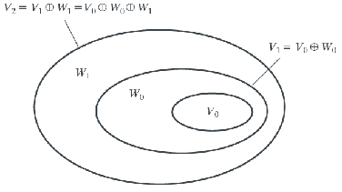

Therefore
$$
L^2(\mathbb{R})=V_\infin=V_{j_0}\oplus W_{j_0}\oplus W_{j_1}\oplus\dots
$$
or even 
$$
L^2(\mathbb{R})=\cdots\oplus W_{-2}\oplus W_{-1}\oplus W_0 \oplus W_1 \oplus W_2\oplus \cdots
$$
completely in terms of wavelets.

Since $W_{j_0} \subseteq V_{j_0+1}$, thus any wavelet function can be expressed as a weighted sum of shifted, double-resolution scaling functions. 
$$
\psi(x)=\sum\limits_n h_\psi(n)\sqrt{2}\phi(2x-n)
$$
where $h_\psi(x)$ is called the _wavelet function coefficients_ and $h_\psi$ is the _wavelet vector_ which satisfies 
$$
h_\psi(n)=(-1)^nh_\psi(1-n)
$$

[__The Haar wavelets__](https://en.wikipedia.org/wiki/Haar_wavelet)

## 7.3 Wavelet Transform in One Dimension

#### The Wavelet Series Expansions

From Eq.(31), we can define the _wavelet series expansion_: 

Given $f(x)\in L^2(R)$ and wavlet $\psi(x)$ and scaling function $\phi(x)$
$$
f(x)=\sum\limits_kc_{j_0}(k)\psi_{j_0,k}(x)+\sum\limits_{j=j_0}^{\infin}\sum\limits_kd_{j_0}(k)\psi_{j_0,k}(x)
$$
where $j_0$ is an arbitrary starting scale. The $c_{j_0}(k)$'s are normally called _approximation_ or _scaling coefficients_ and $d_j(k)$ _'s detail_ or _wavelet coefficients_. The coefficients can computed through integral inner product.

#### The Discrete Wavelet Transform

If the function being expanded is discrete, the resulting coefficients are called the discrete wavelet transform. 

If $f(n)=f(x_0+n\Delta x)$ for some $x_0, \Delta x$ and $n=0,1,2,\dots,M-1$ ,then the _forward_ DWT coefficients for sequence $f(n)$ for orthonormal bases and tight frames:
$$
W_\phi(j_0,k)=\dfrac{1}{\sqrt{M}}\sum\limits_{n}f(n)\phi_{j_0,k}(n)
\\W_\psi(j_0,k)=\dfrac{1}{\sqrt{M}}\sum\limits_{n}f(n)\psi_{j_0,k}(n)\quad for\ j\geq j_0
$$
where $\psi_{j,k}(n)$ and $\phi_{j_0,k}(n)$ are sampled versions.

The complementary _inverse_ DWT:
$$
f(n)=\dfrac{1}{\sqrt{M}}\sum\limits_{k}W_\phi(j_0,k){\phi_{j_0,k}}(n)+\dfrac{1}{\sqrt{M}}\sum_{j=j_0}^{\infin}\sum\limits_{k}W_\psi(j,k){\psi_{j,k}}(n)
$$
Normally, $j_0=0$ and $M=2^J$ so that the summations above are performed over $n=0,1,2,\dots,M-1,j=0,1,2,\dots,J-1$ and $k=0,1,2,\dots,2^j-1$. For Haar wavelets, the discretized scaling and wavlet functions employed in the transform correspond to the Haar transformation matrix. 

#### The Continuous Wavelet Transform

__CWT__ transforms a continous function into a highly redundant function of two continuous variables - _translation_ and _scale_.

$f(x)$ is a continuous, square integrable function, relative to a real-valued wavelet $\psi(x)$ 

__Forward continuous wavelet transform__: 
$$
W_\psi(s,\tau)=\sum^{\infin}_{-\infin}f(x)\psi_{s,\tau}(x)\ dx
$$
where 
$$
\psi_{s,\tau}(x)=\dfrac{1}{\sqrt{s}}\psi\bigg(\dfrac{x-\tau}{s}\bigg)
$$
$s$: _scale_, $\tau$: _translation_

__Inverse continuous wavelet transform__: 
$$
f(x)=\dfrac{1}{C_\psi}\int^{\infin}_0\int^{\infin}_{-\infin}W_\psi(s,\tau)\dfrac{\psi_{s,\tau}(x)}{s^2}\ d\tau\ ds
$$
where 
$$
C_\psi=\int^{\infin}_{-\infin}\dfrac{|\Psi(\mu)|^2}{|\mu|}d\mu<\infin
$$
and $\Psi(\mu)$ is the FT of $\psi(x)$. 

_The Mexican hat_ wavlet: 
$$
\psi(x)=\Bigg(\dfrac{2}{\sqrt{3}}\pi^{-1/4}\Bigg)(1-x^2)e^{-x^2/2}
$$

The transform provides an objective measure of the similiarity between $f(x)$ and the wavelets for which it is computed. It provides both spatial and frequency information.

## 7.4 The Fast Wavelet Transform

The FWT is a computationally efficient implementation of the DWT, also called _Mallat's herringbone algorithm_. 

Starting from the refinement equation, scale $x$ by $2^j$ , translate it by $k$ and letting $m=2k+n$
$$
\phi(2^jx-k)=\sum_mh_\phi(m-2k)\sqrt{2}\phi(2^{j+1}x-m)\phi(2^jx-k)\\
\psi(2^jx-k)=\sum_mh_\psi(m-2k)\sqrt{2}\psi(2^{j+1}x-m)\phi(2^jx-k)
$$
Substitute the above equations into the wavelet expansion coefficients
$$
d_j(k)=\int f(x)2^{j/2}\psi(2^jx-k)\ dx=\sum_mh_\psi(m-2k)c_{j+1}(m)\\
c_j(k)=\int f(x)2^{j/2}\phi(2^jx-k)\ dx=\sum_mh_\phi(m-2k)c_{j+1}(m)
$$
Similarly in DWT:
$$
W_\psi(j,k)=\sum_mh_\psi(m-2k)W_\phi(j+1,m)=h_\psi(-n)*W_\phi(j+1,m)\Bigg|_{n=2k,k\geq0}\\
W_\phi(j,k)=\sum_mh_\phi(m-2k)W_\phi(j+1,m)=h_\phi(-n)*W_\phi(j+1,m)\Bigg|_{n=2k,k\geq0}
$$
which are the defining equations for the compuation of the FWT.

[Big O notation](https://en.wikipedia.org/wiki/Big_O_notation)

![assets/1525599069306.png)

The spectrum of the original function is split into two half-band components.

__The Inverse fast wavelet transform__

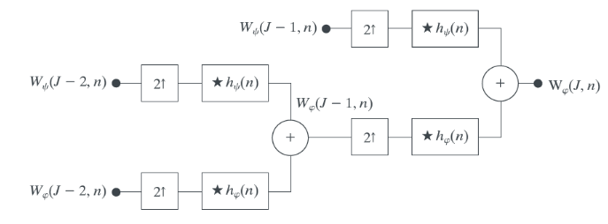

$2\uparrow$ : desampling, inserting zeros. Synthesis filters are determined so as to build a perfect reconstruction system.

The Fourier basis functions guarantee the existence of the FFT, the existence of the FWT depends upon the availability of a scaling function for the wavelets being used.

[Uncertainty Principle in information processing](https://en.wikipedia.org/wiki/Uncertainty_principle#Signal_processing)

The FWT basis functions provide a compromise between the time-domain representation and the frequency domain representation.

## 7.5 Wavelet Transform in Two Dimensions

$\quad\quad$In two-dimensional wavelets, a two-dimensional scaling function $\psi(x,y)$ and three two-dimensional wavelets, $\psi^H(x,y)$, $\psi^V(x,y)$ and $\psi^D(x,y)$ are required, each of which is the product of two one-dimensional functions.
$$
\phi(x,y)=\phi(x)\phi(y)\\
\psi^H(x,y)=\psi(x)\phi(y)\\
\psi^V(x,y)=\phi(x)\psi(y)\\
\psi^D(x,y)=\psi(x)\psi(y)\\
$$
Given separable two-dimensional scaling and wavelet functions:
$$
\phi_{j,m,n}(x,y)=2^{j/2}\phi(2^jx-m,2^jy-n)\\
\psi^i_{j,m,n}(x,y)=2^{j/2}\phi^i(2^jx-m,2^jy-n), \quad i=\{H,V,D\}
$$
__The discrete wavelet transform__ of image $f(x,y)$ of size $M\times N$ is 
$$
W_\phi(j_0,m,n)=\dfrac{1}{\sqrt{MN}}\sum^{M-1}_{x=0}\sum^{N-1}_{y=0}f(x,y)\phi_{j_0,m,n}(x,y)\\
W^i_\psi(j_0,m,n)=\dfrac{1}{\sqrt{MN}}\sum^{M-1}_{x=0}\sum^{N-1}_{y=0}f(x,y)\psi^i_{j_0,m,n}(x,y),\quad i=\{H,V,D\}
$$
We normally let $j_0=0$ and select $N=M=2^J$ so that $j=0,1,2,\dots,J-1$ and $m=n=0,1,2,\dots,2^j-1$

__The inverse discrete wavelet transform__: 
$$
\begin{align}
f(x,y)&=\dfrac{1}{\sqrt{MN}}\sum_m\sum_nW_\phi(j_0,m,n)\phi_{j_0,m,n}(x,y)\\&+\dfrac{1}{\sqrt{MN}}\sum_{i=H,V,D}\sum^{\infin}_{j=j_0}\sum_m\sum_nW^i_\psi(j,m,n)\psi^i_{j,m,n}(x,y)
\end{align}
$$
Like the 1-D discrete wavlet transform, the 2-D DWT can be implemented using digital filters and downsamplers.

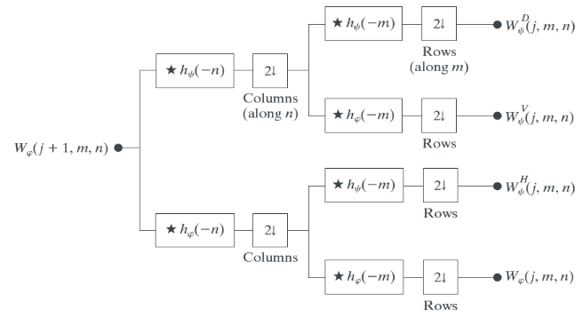

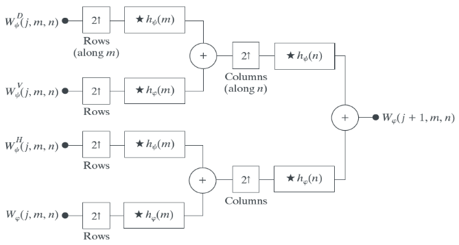

The filter banks above can be used iteratively.

Applicaitons:   

1. Edge detection: set the approximation to zero and do the inverse DWT to obtain the edge, which method is able to extract edges in a certain direction.
2. Noise removal: threshold certain detail coefficients and do the inverse DWT.

## 7.6 Wavelet Packets

Each horizontal strip of constant height tiles contain the basis functions for a single FWT scale. A generalization of the FWT is made to gain greater control of the partitioning of the time-frequency plane.

__Wavelet packets__: conventional wavelet transform in which the details are filtered iteratively.

A P-scale, one(two)-dimensional wavelet packet tree supports
$$
D(P+1)=[D(P)]^{2(4)}+1
$$
A single wavelet packet tree presents numerous decomposition options, whose number is so large that it is impractical to enumerate them individually. Classical entropy- and energy-based cost functions are applicable in many situations and are well suited for use in binary and quaternary tree searching algorithms.

Most transform-based compression schemes work by truncating or thresholding the small coefficients to zero. Define an additive cost function
$$
E(f)=\sum_{m,n}|f(m,n)|
$$
Steps:   

1. Compute both the energy of the node and the energy of its four offspring
2. Compare the energy of the parent and the sum of the energy of the offspring, prune or preserve the offspring according to the relative result.

